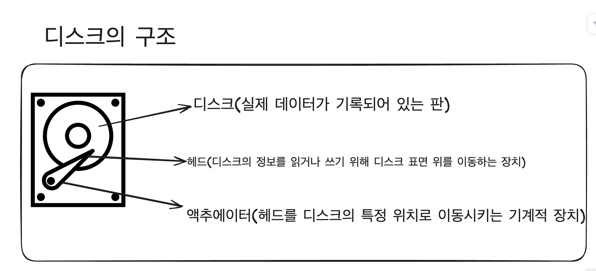
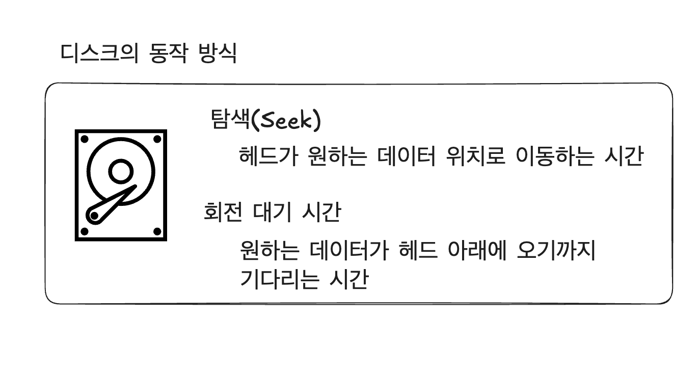
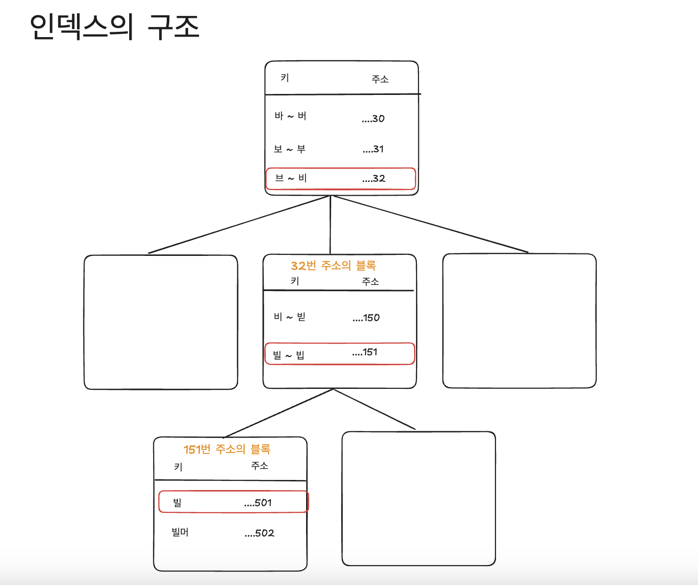
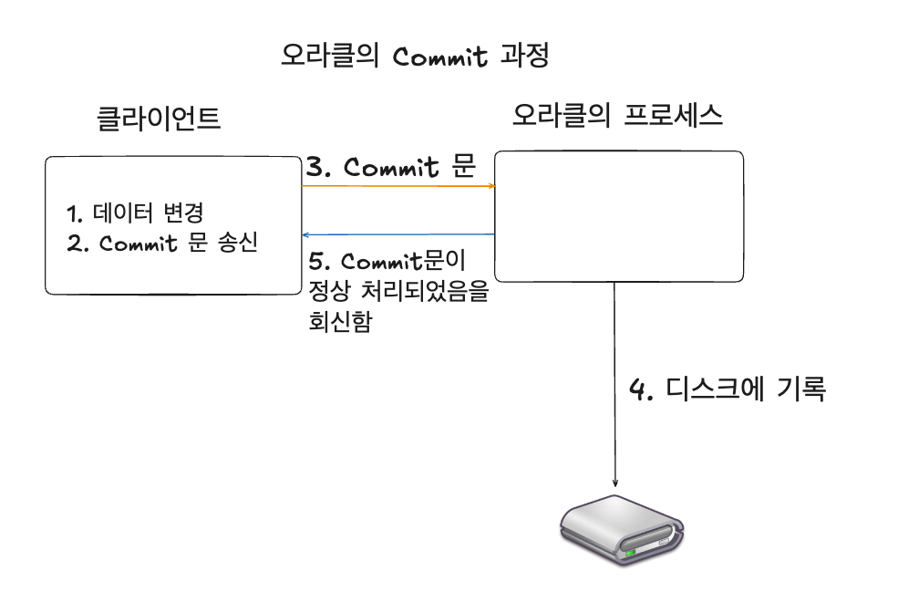

## 디스크와 IO 장치 관계

----


### 오라클을 포함하는 모든 DBMS의 내부 구조가 복잡해지는 이유
- 다음의 3가지 특성을 모두 충족 시켜야 함
 
1. 병렬 처리가 가능하게 하고, 높은 처리량을 실현해야 함
2. 응답 시간을 중요시 함
3. 커밋한 데이터는 영구적으로 지킴

**-> 3가지 특성은 상반된 성향이 있어 동시에 모두 만족시키기에는 매우 어려움**

**예시**
- 커밋한 데이터를 영구적으로 지킴

-> 커밋한 순간에 데이터를 디스크에 기록하고 싶지만, 응답 시간이 나빠지게 됨

- 병렬 처리를 가능하게 하고 높은 처리량을 실현해야 함

-> 병렬 처리할 때 모순되는 처리가 발생되지 않도록 Lock이 필요하며, 그로 인해 성능이 저하됨

<br/>

### 디스크의 구조 및 동작 방식

**오라클과 디스크(HDD)의 관계**
- **오라클은 RDBMS의 종류 중 하나이며, 오라클의 관점에서 DB는 디스크에 저장하고 관리하는 데이터를 의미함**

-> 오라클은 디스크에서 데이터를 읽어오고, 필요한 처리를 한 후, 다시 디스크에 기록함

<br/>

**디스크의 구조**
1. 디스크:  실제 데이터가 기록되어 있는 판
2. 헤드: 디스크의 정보를 읽거나 쓰기 위해 디스크 표면 위를 이동하는 장치
3. 액추에이터: 헤드를 디스크의 특정 위치로 이동시키는 기계적 장치



<br/>

**디스크의 동작 방식**
- I/O 처리에 필요한 디스크의 동작방식

**데이터를 읽기 또는 쓰기 위해 원하는 데이터가 저장되기 시작한 첫머리를 반드시 찾아야 함**

**-> 원하는 위치를 찾는 작업을 "탐색(seek)"라고 함**

- 디스크에서 원하는 정보를 읽을 수 있는 위치가 회전해서 다가올때까지 기다린 후 데이터를 읽고 씀

**-> 원하는 위치가 다가올때까지 기다리는 시간: 회전 대기 시간**

<br/>

**정리**

**1. 탐색: 헤드가 원하는 데이터 위치로 이동하는 과정**
**2. 회전 대기 시간: 원하는 데이터가 헤드 아래에 오기까지 기다리는 시간**



<br/>

**I/O 대기 시간을 줄이기 위한 방법**

**메모리에 테이블이 데이터가 없을 경우**
- **풀 테이블 스캔(Full Table Scan)** 과 **시퀀셜 엑세스(Sequential Access)가 발생**하게 됨
  -> 이 경우, 인덱스를 활용한 랜덤 액세스와 조건절을 사용하는 것이 중요함

<br/>

**인덱스 및 조건절**

예시
- 래리에 대한 소속 정보를 찾고 싶을 때
``` sql
SELECT "소속 회사" 
FROM "개인 데이터"
WHERE "이름" = "래리";
```

작동과정
1. 데이터베이스는 "이름" 열에 대한 인덱스를 읽어옴
2. WHERE 절의 조건 "이름" = "래리"를 기반으로 인덱스를 조사하여 "래리"라는 이름의 주소를 찾음
3. 가져온 주소를 사용하여 디스크에서 실제 데이터를 읽어옴
4. 읽어온 데이터 속에서 찾고 있더 데이터를 발견함

<br/>
👨🏻‍🏫 정리

인덱스: 특정 열의 값을 기반으로 데이터를 빠르게 찾기 위해 미리 생성된 데이터 구조
WHERE절: 조건을 설정하여 검색할 데이터를 필터링하는 부분으로, 인덱스와 함께 사용되어 성능을 향상 시킴
- 인덱스는 WHERE절의 조건에 따라 데이터를 효율적으로 도움을 줌

<br/>

인덱스의 크기

**Q. 인덱스 자체의 크기가 커지면 큰 테이블을 조회하는 것과 마찬가지로 작업에 필요한 시간이 늘어나게 될까?**

-> No
- 오라클의 인덱스는 트리 구조로 되어 있으며, 인덱스에 인덱스를 추가하는 것처럼 여러 계층으로 구성되어 있기 때문

장점
- 인덱스의 필요가 없는 부분을 읽지 않고 검색을 끝낼 수 있기 때문



<br/>

**랜덤 액세스**

- 인덱스를 사용할 때는 필요한 부분만 읽어오면 충분하지만, 필요한 부분이 디스크 위에 연속적으로 존재하는 경우는 거의 없음

-> 헤드를 움직여 띄엄띄엄 접근하게 됨(**랜덤 액세스**)

디스크의 관점
- 랜덤 액세스의 경우, 탐색하는 작업과 회전 대기로 인해 데이터에 띄엄띄엄 접근할 때마다 시간이 소요되기에 비효율적임

 실제 데이터 전송 효율 측면의 관점
- DBMS의 I/O 역시 탐색을 반복하기 때문에, 디스크에 병목현상이 발생할 수도 있음

<br/>

### 데이터를 보증하기 위한 디스크 
- 오라클 DB의 데이터는 Commit 시 디스크에 기록하게 됨

**기록과정**
1. 트랮낵션 시작: 데이터 변경 작업이 수행됨
2. 변경 사항 저장: 변경된 데이터는 메모리에 저장됨
3. Commit 실행: Commit 명령어를 호출하면, 메모리에 있는 변경 사항이 디스크에 영구적으로 기록됨
4. 트랜잭션 종료: Commit 후, 트랜잭션이 종료됨

-> 이렇게 기록된 데이터는 비정상 종료 시에도 유지됨


