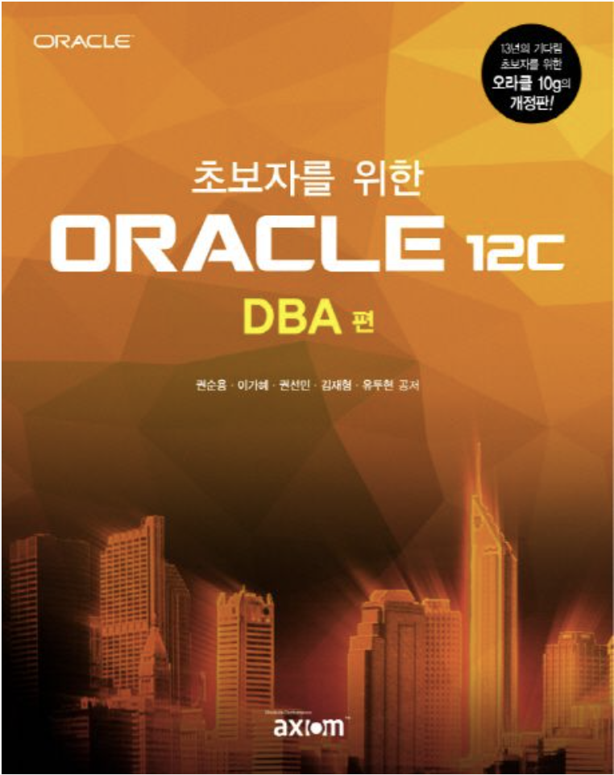

## 💻 오라클 DB 레포지 토리

---

### 책: 그림으로 공부하는 오라클 구조, 초보자를 위한 ORACLE 12c DBA 편

<div style="display: flex;">
    
    
</div>

<br/>

## 📁 디렉터리 구조

---

```text
Oracle-DB
│
└──  유저명(깃허브 아이디명)
       └── 주제명 디렉터리
         └── ~ 주제 정리.md
         └── images
                └── 1.png
```

<br/>

## 👉Commit 규칙

---
- 해당 깃허브 레포지토리에 자신의 깃허브 이름의 브랜치를 만든 후, 자신의 브랜치에 commint 후 PR을 올립니다!


```text
docs: ~주제 정리
```